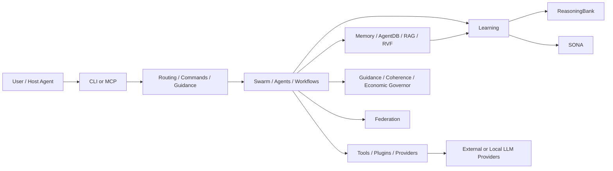

# Ruflo Architecture Map

Status: **initial static map — not yet a complete call graph**

## Top-level execution model

This diagram reflects repository surfaces found during initial inspection. Each edge must still be verified against runtime call paths.

## 1. CLI / bootstrap

Primary landmark:

- `v3/@claude-flow/cli/src/commands/index.ts`

The registry exposes command families including:

- `agent`
- `swarm`
- `memory`
- `mcp`
- `hooks`
- `workflow`
- `neural`
- `security`
- `providers`
- `plugins`
- `route`
- `guidance`
- `autopilot`
- `metaharness`

### Open questions

- Which command paths are thin wrappers versus core execution paths?
- Which paths invoke MCP internally?
- What components are daemonized?
- What state is process-local versus persistent?

## 2. Learning / ReasoningBank

Observed implementations:

- `v3/@claude-flow/neural/src/reasoning-bank.ts`
- `v3/@claude-flow/hooks/src/reasoningbank/index.ts`
- `v3/@claude-flow/neural/src/reasoningbank-adapter.ts`

Repository comments describe a pipeline around trajectory retrieval, judgment, distillation and consolidation.

### Key questions

- What constitutes a trajectory?
- Who assigns success/failure verdicts?
- Can model output self-authorize learning?
- What data is persisted versus held in memory?
- What prevents a poisoned trajectory from becoming a reusable pattern?
- Are learned patterns provenance-linked to the originating evidence?

## 3. SONA

Observed surfaces:

- `v3/mcp/tools/sona-tools.ts`
- `v3/@claude-flow/memory/src/persistent-sona.ts`
- `v3/@claude-flow/neural/docs/SONA_INTEGRATION.md`

The MCP tooling contains trajectory-oriented operations and learning controls.

### Key questions

- Does SONA modify weights, adapters, routing policy, memory, or some combination?
- Is LoRA adaptation actually executed in the standard runtime?
- Is mutation reversible/versioned?
- What is the admission gate for learned state?

## 4. Guidance / coherence

Implementation:

- `v3/@claude-flow/guidance/src/coherence.ts`

Observed logic:

- coherence score derived from violation rate, rework and intent drift
- score mapped to privilege levels:
  - full
  - restricted
  - read-only
  - suspended
- economic governor tracks resource dimensions such as tokens, tool calls, storage, time and cost

### Research interest

This is close to an explicit harness-boundary control plane rather than relying solely on model reasoning.

Need to verify whether the computed privilege level is merely advisory or is actually enforced on tool execution.

## 5. MetaHarness

Relevant ADR:

- `v3/docs/adr/ADR-321-metaharness-hard-dependency.md`

The ADR records a transition from optional/removable augmentation to hard runtime dependencies for selected MetaHarness packages.

### Key questions

- Which MetaHarness functions execute in-process?
- Which shell out through `npx`?
- Are package versions pinned strongly enough for reproducible evaluation?
- Which capabilities can mutate project state?
- Does MetaHarness evaluate runtime behavior or mostly static configuration?

## 6. Federation

Relevant ADR:

- `v3/docs/adr/ADR-387-chatgpt-federation-connector.md`

The design explicitly separates a publishing participant's signing identity from the gateway and states that credentials arrive via transport rather than model-visible tool arguments.

### Security questions

- What trust establishes peer admission?
- How are revocation and rotation handled?
- What is the replay protection model?
- What authorization context reaches the receiving agent/tool?
- Is federation data allowed to influence persistent learning automatically?

## 7. Root dependency surface

The root `package.json` shows a mixed architecture with direct and optional dependencies including:

- `@claude-flow/mcp`
- `@claude-flow/neural`
- `@claude-flow/plugin-agent-federation`
- `@claude-flow/security`
- `@ruvector/router`
- `@ruvector/sona`
- `agentdb`
- `agentic-flow`
- `better-sqlite3`
- `@ruvector/ruvllm`

The repository therefore needs a supply-chain and native-module audit before we execute its complete install/runtime stack.

## Next traces

1. bootstrap: `bin/cli.js` → v3 CLI entry
2. `swarm` command → coordinator implementation
3. `route` command → actual routing engine(s)
4. MCP server registration → tool registry → authorization
5. memory command → storage adapter → persistence backend
6. hooks → trajectory capture → ReasoningBank
7. SONA trajectory finalization → learning mutation
8. `ruflo-ruvllm` / provider routing → Ollama path
9. federation plugin → transport → auth → receiving dispatch
10. MetaHarness command → subprocess/in-process boundary
